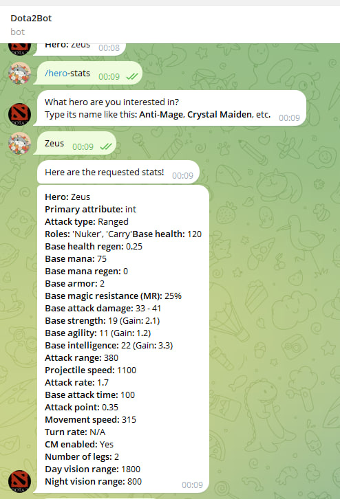
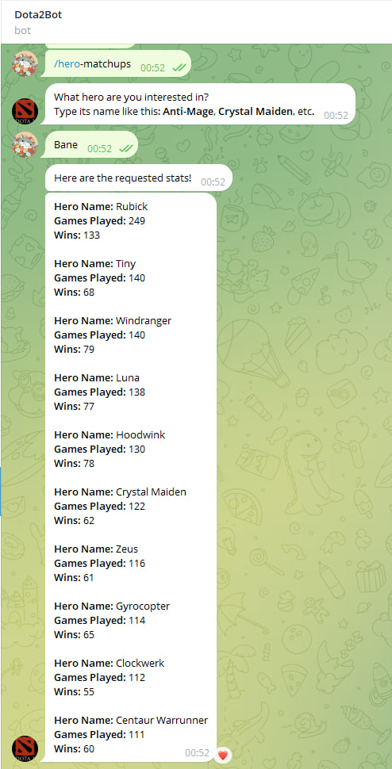

# Telegram Bot for Dota 2 Hero Stats and Matchups


This repository contains a Python-based Telegram bot that provides Dota 2 hero statistics and matchup information. The bot interacts with users through the following commands:

1. **`/hero-stats`**: Returns basic stats for a specified Dota 2 hero.
2. **`/matchups`**: Retrieves the hero's matchups and their win rates.

## Features

- **Easy-to-use commands**: Quickly access detailed hero stats and matchup data.
- **Real-time information**: Ensures accurate and updated data using the Dota 2 API.
- **Simple deployment**: Deployable on any Python environment with Telegram Bot API support.

---

## Commands

### `/hero-stats`

This command provides the basic statistics for the specified Dota 2 hero. After the command the user will need to provide the Hero's name.

**Example Usage:**
```
/hero-stats
```

**Response:**
```
Hero: Zeus
Primary attribute: int
Attack type: Ranged
Roles: 'Nuker', 'Carry'
Base health: 120
Base health regen: 0.25
Base mana: 75
Base mana regen: 0
Base armor: 2
Base magic resistance (MR): 25%
Base attack damage: 33 - 41
Base strength: 19 (Gain: 2.1)
Base agility: 11 (Gain: 1.2)
Base intelligence: 22 (Gain: 3.3)
Attack range: 380
Projectile speed: 1100
Attack rate: 1.7
Base attack time: 100
Attack point: 0.35
Movement speed: 315
Turn rate: N/A
CM enabled: Yes
Number of legs: 2
Day vision range: 1800
Night vision range: 800
```



### `/matchups`

This command returns the hero's matchups, including win rates against other heroes. After the command the user will need to provide the Hero's name.

**Example Usage:**
```
/matchups
```

**Response:**
```
Hero Name: Rubick
Games Played: 249
Wins: 133

Hero Name: Tiny
Games Played: 140
Wins: 68

Hero Name: Windranger
Games Played: 140
Wins: 79

Hero Name: Luna
Games Played: 138
Wins: 77

Hero Name: Hoodwink
Games Played: 130
Wins: 78

Hero Name: Crystal Maiden
Games Played: 122
Wins: 62

Hero Name: Zeus
Games Played: 116
Wins: 61

Hero Name: Gyrocopter
Games Played: 114
Wins: 65

Hero Name: Clockwerk
Games Played: 112
Wins: 55

Hero Name: Centaur Warrunner
Games Played: 111
Wins: 60
...
```

---



## Installation

1. Clone this repository:
   ```bash
   git clone https://github.com/DEIDARA285231/Dota-2-Bot.git
   cd Dota-2-Bot
   ```

2. Install the required Python libraries:
   ```bash
   pip install -r requirements.txt
   ```

3. Create a bot on Telegram using [BotFather](https://core.telegram.org/bots#botfather) and get your bot token.

4. Set up environment variables:
   - Create a `.env` file in the project directory.
     ```env
     TELEGRAM_BOT_TOKEN=your_telegram_bot_token
     ```

5. Run the bot:
   ```bash
   python bot.py
   ```

---

## How It Works

1. **User Interaction**: Users send commands (`/hero-stats` or `/matchups`) to the bot on Telegram.
2. **Data Retrieval**:
   - The bot processes the command and asks for an hero name.
   - It fetches data from the Open Dota 2 API.
3. **Response**: The bot formats the data and sends it back to the user as a message.

---

## Configuration

- **Environment Variables**: The bot uses environment variables to securely manage sensitive information such as API keys.
- **Hero Data Source**: The bot fetches hero stats and matchup data using the Open Dota 2 API.

---

## Contributing

Feel free to contribute to this project!
IT IS STILL UNDER DEVELOPMENT.
Here’s how you can help:

1. Fork this repository.
2. Create a new branch: `git checkout -b feature-branch-name`
3. Make your changes and commit: `git commit -m 'Add some feature'`
4. Push the branch: `git push origin feature-branch-name`
5. Submit a pull request.

---

## License

This project is licensed under the MIT License. See the [LICENSE](LICENSE) file for more details.

---

## Acknowledgments

- [Telegram Bot API](https://core.telegram.org/bots/api) for providing a simple interface to interact with Telegram.
- [OpenDota API](https://docs.opendota.com/) or other Dota 2 APIs for reliable hero stats and matchup data.

---

## Questions or Issues?

If you have any questions or run into any issues, feel free to open an issue on this repository or contact me on Telegram (DEIDARA285231)!

---

## Suggestions?

If you have suggestions on functionalities that you would like to see implemented please reach out to me on Telegram (DEIDARA285231)!

## Next steps

- It currently needs my local backend to run, I'll be putting the bot in a cloud hosting.
- Add more functionalities regarding matches and best players.